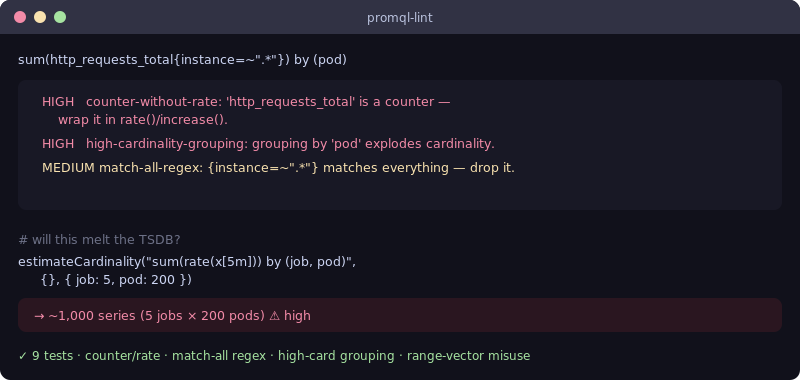

# promql-lint

[](https://github.com/JCreatesGH/promql-lint/actions)
[](https://www.typescriptlang.org/)
[](LICENSE)

Lint **PromQL** for the mistakes that break dashboards or melt your TSDB — raw counters, match-all regexes, high-cardinality grouping — and estimate how many series a query will fan out to *before* you run it.



## Install

```bash
npm install promql-lint
```

## Lint

```ts
import { lint } from "promql-lint";

lint('sum(http_requests_total{instance=~".*"}) by (pod)');
// HIGH   counter-without-rate      : wrap a _total counter in rate()/increase()
// HIGH   high-cardinality-grouping : grouping by 'pod' explodes cardinality
// MEDIUM match-all-regex           : {instance=~".*"} matches everything
```

## CLI

Installing the package gives you a `promql-lint` command for shells and CI:

```bash
$ promql-lint 'sum(http_requests_total{instance=~".*"}) by (pod)'
HIGH    counter-without-rate       'http_requests_total' is a counter — wrap it in rate()/increase()…
HIGH    high-cardinality-grouping  Grouping by 'pod' explodes cardinality…
MEDIUM  match-all-regex            http_requests_total{instance=~".*"} matches everything…

3 issues (2 high, 1 medium)
```

It **exits `1` when any HIGH-severity issue is found** (so it fails CI), otherwise `0`. Add `--json` for machine-readable output.

## Estimate cardinality

```ts
import { estimateCardinality } from "promql-lint";

estimateCardinality("sum(rate(x[5m])) by (job, pod)", {}, { job: 5, pod: 200 });
// 1000   (5 jobs × 200 pods)
```

## Rules

| Severity | Rule | Catches |
|----------|------|---------|
| HIGH | `counter-without-rate` | a `_total` counter not wrapped in `rate()`/`irate()`/`increase()` |
| HIGH | `high-cardinality-grouping` | `by (pod/instance/id/…)` |
| MEDIUM | `match-all-regex` | `label=~".*"` / `".+"` |
| MEDIUM | `range-without-function` | a `[5m]` range vector not reduced by a range function |
| MEDIUM | `large-range-vector` | a range vector longer than a day (use a recording rule) |
| LOW | `no-matchers` | a bare metric with no label matchers |

The extractor pulls metric selectors, matchers, functions, and `by(...)` labels with a tolerant regex pass — no full parser needed. Label-list clauses (`by`, `on`, `ignoring`, `group_left/right`) are stripped first so their labels are never mistaken for metrics, and all of PromQL's range functions (`rate`, `increase`, every `*_over_time`, …) are recognized.

## Development

```bash
npm install && npm test    # 20 tests
npm run build              # tsc, clean
```

## License

MIT
